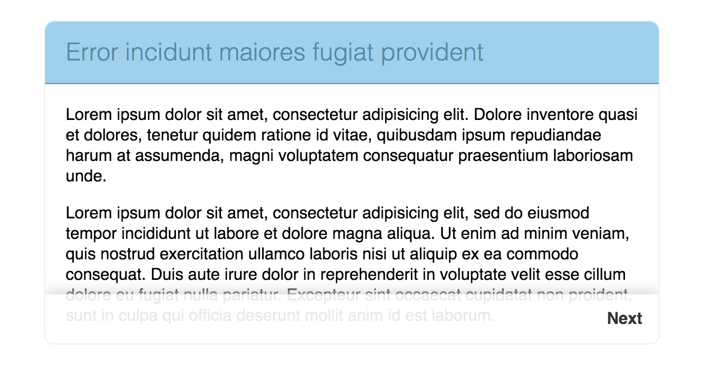
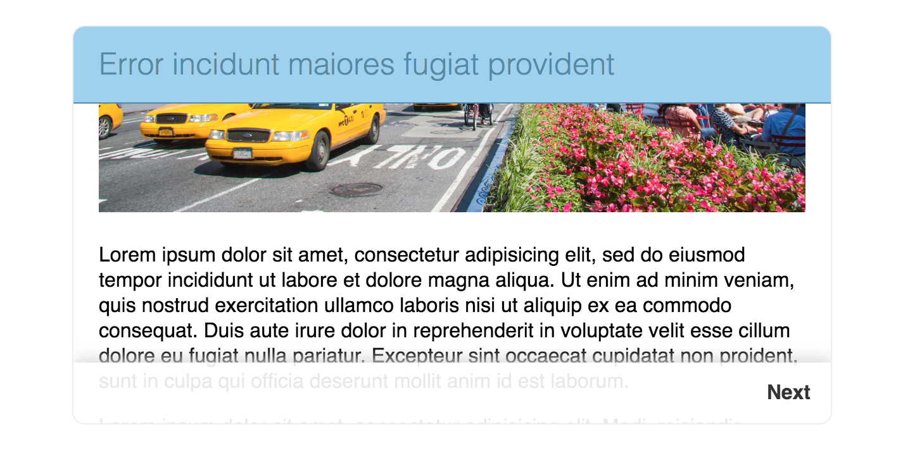
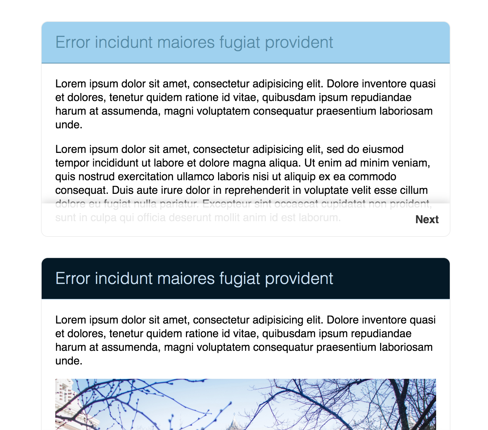

# Sticky headers

Create a card that looks like the one in the example:

- [x] the header of the card sticks to the top of the card when content is scrolled
- [x] the headline has a lighter font weight

- [x] add few cards (note theming)

- [x] a next button stays at the bottom of the card (it does not overlap any content)
- [x] next button has some shadow and transparent background color
- [x] the next button scrolls to the next section
